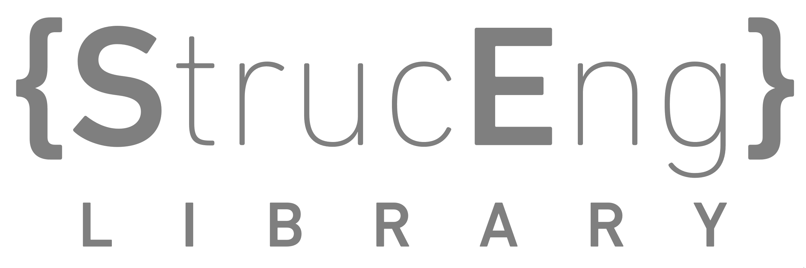

[](https://github.com/StrucEng-Library-kfmresearch/strucenglib-website/actions/workflows/deploy.yml)



Welcome to the StrucEng Library. This project contains the Markdown and assets for our ProperDocs website, using the MaterialX theme.


For a tutorial on how to make changes on the website, please read [tutorial_edit_website.md](./tutorial_edit_website.md).

### Local preview

```sh
python -m venv .venv
python -m pip install -r .github/requirements.txt
properdocs serve
```

Activate the virtual environment before the last two commands: run `.\.venv\Scripts\Activate.ps1` in Windows PowerShell or `source .venv/bin/activate` on macOS and Linux.

The site configuration is in `properdocs.yml`; navigation and site-wide theme settings are maintained there.

### Branches
```
master...................: Hosts website
docs/compas..............: Hosts API doc of strucenglib compas version
docs/compas_fea..........: Hosts API doc of strucenglib compas_fea version
gh_pages.................: Hosts static assets mirrored with webserver
```

We host our own version of compas/compas_fea API documentation. The API doc is based on the forks of strucenglib version of compas/compas_fea.
